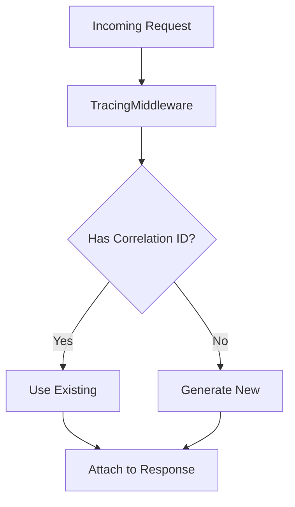

# Architecture Documentation Generator

Generate comprehensive architecture documentation that defines the technical organization and structure of the Laravel package.

---

## 1. Load Context

Read the following files in order to understand the project:

1. **Product Requirements**: `docs/PRD.md`
    - Understand what needs to be built (functional requirements)
    - Identify scope boundaries (in/out of scope)
    - Note non-functional requirements (performance, security, scalability)

2. **Code Standards**: `docs/engineering/CODE_STANDARDS.md`
    - Development philosophy (No DDD, pragmatic SOLID, etc.)
    - Architecture goals (extensible, pluggable, testable)
    - Refactoring and autonomy boundaries

3. **Tech Stack**: `docs/engineering/STACK.md`
    - Runtime requirements (PHP 8.4+, Laravel 12)
    - Available dependencies
    - Testing environment (Orchestra Testbench)

4. **Existing Architecture** (if any): `docs/architecture/*.md`
    - Check what architecture documentation already exists
    - Update rather than recreate when possible

---

## 2. Clarify Missing Information

If critical architectural decisions are ambiguous:

- Identify the specific decision point
- Ask **up to five clear questions** in Portuguese (pt-BR)
- Do **not** guess or assume architectural patterns
- Do **not** introduce layers, patterns, or abstractions without asking

---

## 3. Architecture Documentation Structure

Generate architecture documents covering these aspects:

### Core Areas

1. **Package Structure** (`STRUCTURE.md`)
    - Directory organization
    - Namespace mapping
    - File placement rules
    - Where to add new features

2. **Component Architecture** (`COMPONENTS.md`)
    - Core classes and their responsibilities
    - Service Provider role
    - Facade pattern usage
    - Extension points (custom tracing sources)

3. **Data Flow** (`DATA_FLOW.md`)
    - Request lifecycle (incoming → tracing → response)
    - Job dispatch and execution flow
    - HTTP client integration flow
    - Session persistence mechanism

4. **Configuration Architecture** (`CONFIGURATION.md`)
    - Config file structure
    - Environment variable mapping
    - How to add new config options
    - Default values strategy

5. **Extension Architecture** (`EXTENSIONS.md`)
    - How to add custom tracing sources
    - How to replace built-in tracings
    - Contract/interface definitions
    - Pluggability mechanism

### Optional Areas (create only if needed)

- **Security Considerations** (`SECURITY.md`) - If security is critical (e.g., input validation, sanitization)
- **Performance Architecture** (`PERFORMANCE.md`) - If performance optimization is complex
- **Testing Architecture** (`TESTING_ARCHITECTURE.md`) - If test organization is non-trivial

---

## 4. File Output Rules

### Naming Convention

Use semantic slugs:

- `docs/architecture/STRUCTURE.md`
- `docs/architecture/COMPONENTS.md`
- `docs/architecture/DATA_FLOW.md`
- etc.

Use **UPPERCASE.md** for architecture documents to distinguish from other docs.

### Content Guidelines

Each architecture document must:

1. **Be implementation-focused**
    - Show actual class names, namespaces, file paths
    - Include directory trees where helpful
    - Reference specific files from the codebase

2. **Be developer-oriented**
    - Answer "where do I add X?" questions
    - Explain "why" architectural decisions were made
    - Document constraints and trade-offs

3. **Be concise**
    - Use bullet points and diagrams (Mermaid)
    - Avoid repeating information from other docs
    - Link to other docs rather than duplicating

4. **Be maintainable**
    - Don't describe every class in detail
    - Focus on patterns and key components
    - Keep synchronized with code changes

---

## 5. Document Template

Use this template for each architecture document:

```markdown
# [Area Name]

**Purpose**: [One sentence describing what this document covers]

---

## Overview

[2-3 paragraphs explaining the high-level architecture of this area]

---

## [Section 1]

[Details, code examples, directory trees, etc.]

---

## [Section 2]

[Continue with logical sections]

---

## Key Decisions

[Document important architectural decisions and rationale]

---

## Extension Points

[If applicable: where and how developers can extend this area]

---

## Related Documentation

- Link to other relevant architecture docs
- Link to PRD requirements this architecture addresses
- Link to code standards that influenced this design
```

---

## 6. Mermaid Diagrams

Use Mermaid diagrams for:

- **Class relationships**: `classDiagram`
- **Data flow**: `flowchart` or `sequenceDiagram`
- **Component organization**: `graph`

Example:



Keep diagrams simple and focused on one concept.

---

## 7. Architecture Principles (from CODE_STANDARDS.md)

Ensure all architectural decisions follow:

- ✅ No DDD (no aggregates, repositories)
- ✅ No unnecessary abstraction
- ✅ Configuration over hard-coded logic
- ✅ Extensible and pluggable by default
- ✅ Clear, single responsibility per class
- ✅ Pragmatic application of SOLID

---

## 8. Validation Checklist

Before completing, verify:

- [ ] All functional requirements from PRD are addressed architecturally
- [ ] Architecture follows code standards (no DDD, pragmatic SOLID)
- [ ] Architecture is compatible with tech stack (Laravel 12, PHP 8.4+)
- [ ] Extension points are clearly documented
- [ ] Directory structure is explicit and clear
- [ ] Key classes and their responsibilities are defined
- [ ] Data flows are documented
- [ ] No unnecessary architectural layers introduced

---

## 9. Output Location

Write all architecture documentation to:

```
docs/architecture/
├── STRUCTURE.md
├── COMPONENTS.md
├── DATA_FLOW.md
├── CONFIGURATION.md
└── EXTENSIONS.md
```

---

## 10. Updating Existing Architecture

When architecture documents already exist:

1. Read existing docs first
2. Identify what needs updating
3. Update specific sections rather than rewriting
4. Maintain consistency with existing style
5. Note breaking changes if architecture evolves

---

## 11. Cross-References

After creating/updating architecture docs:

1. Update `CLAUDE.md` if needed (add references to architecture docs)
2. Ensure PRD requirements trace to architectural components
3. Link architecture docs to relevant code standard sections

---

## Completion Criteria

Architecture documentation is complete when:

1. ✅ All core areas are documented
2. ✅ Developers can answer "where do I add X?" questions
3. ✅ Key architectural decisions are explained with rationale
4. ✅ Extension points are clearly defined
5. ✅ Documents are cross-referenced properly
6. ✅ No architectural violations of code standards exist
