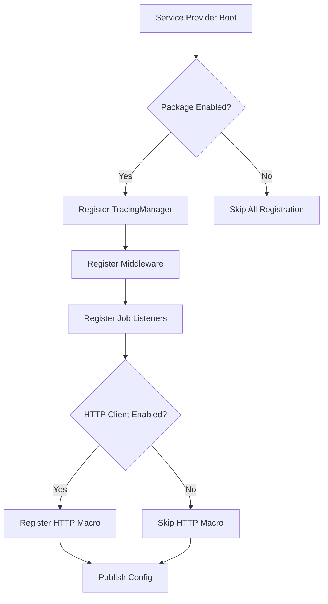
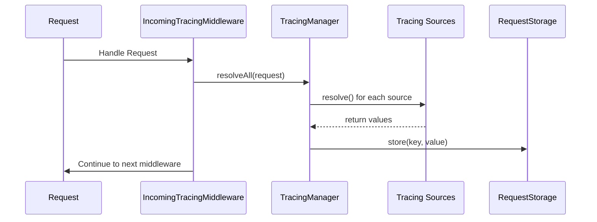
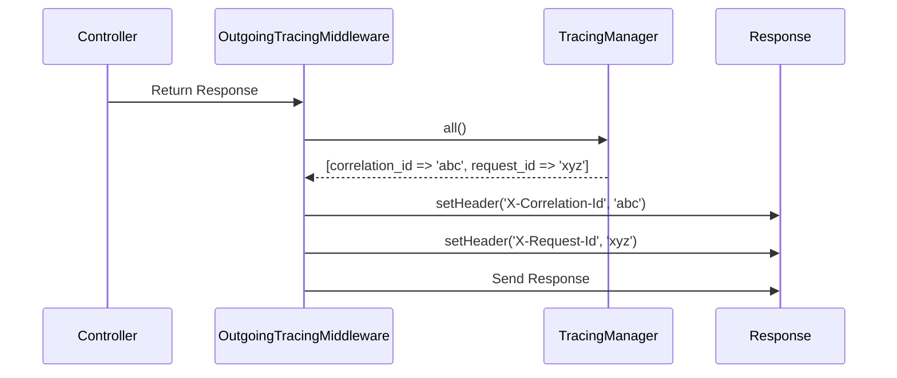
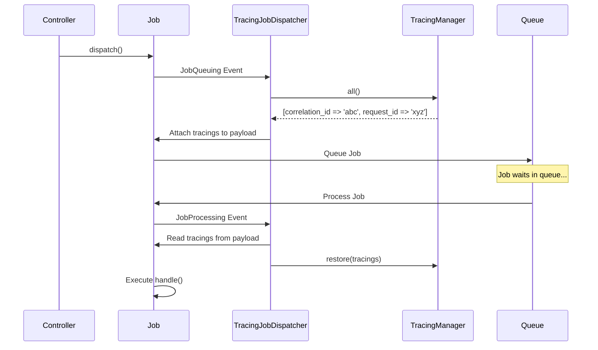
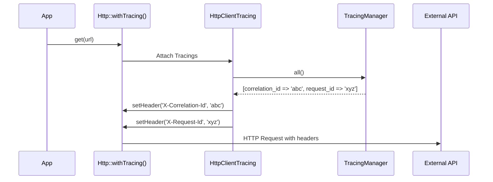
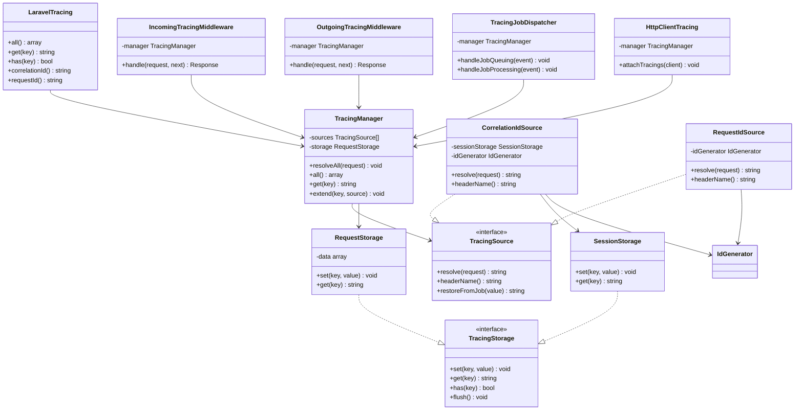

# Component Architecture

**Purpose**: Define core components, their responsibilities, and relationships.

---

## Overview

The Laravel Tracing package is composed of several focused components, each with a single, clear responsibility. The architecture avoids unnecessary abstraction while maintaining extensibility through well-defined contracts.

**Design Principles**:
- **Single Responsibility** - Each component has one well-defined purpose
- **Dependency Inversion** - Depend on contracts, not concrete implementations
- **Open/Closed** - Extend via configuration and contracts, not modification
- **No DDD** - No repositories, aggregates, or domain services

---

## Core Components

### 1. LaravelTracing (Main Class)

**Location**: `src/LaravelTracing.php`
**Namespace**: `JuniorFontenele\LaravelTracing`

**Purpose**: Main API for accessing tracing values throughout the application.

**Responsibilities**:
- Provide global accessor to current tracing values
- Delegate to `TracingManager` for actual resolution
- Expose fluent API for retrieving tracing data

**Key Methods**:
```php
class LaravelTracing
{
    // Get all active tracing values as key-value array
    public function all(): array

    // Get specific tracing value by key
    public function get(string $key): ?string

    // Check if a tracing key exists
    public function has(string $key): bool

    // Get correlation ID specifically
    public function correlationId(): ?string

    // Get request ID specifically
    public function requestId(): ?string
}
```

**Dependencies**:
- `TracingManager` - Manages active tracings and resolution

**Usage Example**:
```php
use JuniorFontenele\LaravelTracing\Facades\LaravelTracing;

// In controllers, jobs, services, etc.
$correlationId = LaravelTracing::correlationId();
$allTracings = LaravelTracing::all();
```

---

### 2. LaravelTracingServiceProvider

**Location**: `src/LaravelTracingServiceProvider.php`
**Namespace**: `JuniorFontenele\LaravelTracing`

**Purpose**: Bootstrap the package and register services.

**Responsibilities**:
- Register package services in Laravel's container
- Register middleware (incoming and outgoing)
- Publish configuration file
- Merge default config
- Register HTTP client macro (if enabled)
- Register job event listeners (for tracing propagation)

**Key Registration Steps**:
1. Merge config from `config/laravel-tracing.php`
2. Register `TracingManager` as singleton
3. Register middleware in HTTP kernel middleware stack
4. Register job dispatching and processing listeners
5. Register HTTP client macro (opt-in)
6. Publish config file

**Bootstrap Flowchart**:


---

### 3. TracingManager

**Location**: `src/Tracings/TracingManager.php`
**Namespace**: `JuniorFontenele\LaravelTracing\Tracings`

**Purpose**: Manage all active tracing sources and coordinate resolution.

**Responsibilities**:
- Load tracing sources from configuration
- Resolve tracing values from sources (lazy evaluation)
- Store resolved values in request-scoped storage
- Provide access to all current tracing values
- Handle enable/disable toggles for individual tracings

**Key Methods**:
```php
class TracingManager
{
    // Resolve all active tracings from configured sources
    public function resolveAll(Request $request): void

    // Get all resolved tracing values
    public function all(): array

    // Get specific tracing value
    public function get(string $key): ?string

    // Check if tracing key exists
    public function has(string $key): bool

    // Register a custom tracing source at runtime
    public function extend(string $key, TracingSource $source): void
}
```

**Dependencies**:
- `TracingSource[]` - Array of configured tracing sources
- `RequestStorage` - Store resolved values for current request

**Lifecycle**:
1. **Boot** (Service Provider): Load sources from config
2. **Request Start** (Middleware): Resolve all tracings from incoming request
3. **Request Lifecycle**: Provide access to resolved values
4. **Response**: Attach resolved values to outgoing response headers

---

### 4. Middleware

#### 4.1. IncomingTracingMiddleware

**Location**: `src/Middleware/IncomingTracingMiddleware.php`
**Namespace**: `JuniorFontenele\LaravelTracing\Middleware`

**Purpose**: Handle incoming HTTP requests and resolve tracing values.

**Responsibilities**:
- Trigger `TracingManager::resolveAll()` for incoming request
- Store resolved values in request-scoped storage
- Execute early in middleware stack (before controllers)

**Execution Flow**:


**Priority**: Should run early in middleware stack to ensure tracing is available throughout request lifecycle.

#### 4.2. OutgoingTracingMiddleware

**Location**: `src/Middleware/OutgoingTracingMiddleware.php`
**Namespace**: `JuniorFontenele\LaravelTracing\Middleware`

**Purpose**: Attach tracing headers to outgoing HTTP responses.

**Responsibilities**:
- Read all current tracing values from `TracingManager`
- Attach each tracing as a response header (using configured header names)
- Execute late in middleware stack (after controllers, before response sent)

**Execution Flow**:


**Priority**: Should run late in middleware stack, just before response is sent.

---

### 5. Tracing Sources

#### 5.1. TracingSource Contract

**Location**: `src/Tracings/Contracts/TracingSource.php`
**Namespace**: `JuniorFontenele\LaravelTracing\Tracings\Contracts`

**Purpose**: Define the interface all tracing sources must implement.

**Contract Definition**:
```php
interface TracingSource
{
    // Resolve the tracing value from the current request context
    public function resolve(Request $request): string;

    // Get the header name for this tracing (e.g., 'X-Correlation-Id')
    public function headerName(): string;

    // Restore value from serialized job payload (optional, default to value passthrough)
    public function restoreFromJob(string $value): string;
}
```

**Why This Contract**:
- **`resolve()`**: Every tracing must know how to get its value (from header, session, or generate)
- **`headerName()`**: Each tracing has a configurable header name
- **`restoreFromJob()`**: Allows sources to customize how values are restored in queued jobs

#### 5.2. CorrelationIdSource

**Location**: `src/Tracings/Sources/CorrelationIdSource.php`
**Namespace**: `JuniorFontenele\LaravelTracing\Tracings\Sources`

**Purpose**: Built-in tracing source for correlation ID (session-scoped).

**Resolution Priority**:
1. **External header** (if `accept_external_headers` enabled): Read from request header
2. **Session storage**: Read from user's session (persisted from previous requests)
3. **Generate new**: Generate UUID and persist in session

**Key Behavior**:
- **Session Persistence**: Correlation ID is stored in Laravel session and reused across requests
- **Session Key**: `laravel_tracing.correlation_id`
- **External Headers**: Only accepted if `config('laravel-tracing.accept_external_headers')` is `true`

**Dependencies**:
- `SessionStorage` - Persist correlation ID in user session
- `IdGenerator` - Generate UUID when no ID exists
- `HeaderSanitizer` - Validate incoming header values

#### 5.3. RequestIdSource

**Location**: `src/Tracings/Sources/RequestIdSource.php`
**Namespace**: `JuniorFontenele\LaravelTracing\Tracings\Sources`

**Purpose**: Built-in tracing source for request ID (request-scoped).

**Resolution Priority**:
1. **External header** (if `accept_external_headers` enabled): Read from request header
2. **Generate new**: Generate UUID for this request

**Key Behavior**:
- **Request-Scoped**: New request ID is generated for each request
- **Job Propagation**: When propagated to jobs, the original request ID is preserved (not regenerated)
- **External Headers**: Only accepted if `config('laravel-tracing.accept_external_headers')` is `true`

**Dependencies**:
- `IdGenerator` - Generate UUID
- `HeaderSanitizer` - Validate incoming header values

---

### 6. Storage Backends

#### 6.1. TracingStorage Contract

**Location**: `src/Tracings/Contracts/TracingStorage.php`
**Namespace**: `JuniorFontenele\LaravelTracing\Tracings\Contracts`

**Purpose**: Define interface for tracing value storage.

**Contract Definition**:
```php
interface TracingStorage
{
    // Store a tracing value
    public function set(string $key, string $value): void;

    // Retrieve a tracing value
    public function get(string $key): ?string;

    // Check if a tracing value exists
    public function has(string $key): bool;

    // Clear all tracing values
    public function flush(): void;
}
```

#### 6.2. RequestStorage

**Location**: `src/Storage/RequestStorage.php`
**Namespace**: `JuniorFontenele\LaravelTracing\Storage`

**Purpose**: Store tracing values for the current request lifecycle.

**Implementation**:
- Uses in-memory array (request-scoped)
- Values are cleared when request ends
- Used by `TracingManager` to cache resolved values

#### 6.3. SessionStorage

**Location**: `src/Storage/SessionStorage.php`
**Namespace**: `JuniorFontenele\LaravelTracing\Storage`

**Purpose**: Persist correlation ID across multiple requests in user session.

**Implementation**:
- Uses Laravel's session driver (`session()->put()`, `session()->get()`)
- Values persist across requests for the same user session
- Used by `CorrelationIdSource` to maintain correlation ID

**Session Key Format**: `laravel_tracing.{tracing_key}`

**Example**:
- Correlation ID: `laravel_tracing.correlation_id`

---

### 7. Queue Integration

#### 7.1. TracingJobDispatcher

**Location**: `src/Jobs/TracingJobDispatcher.php`
**Namespace**: `JuniorFontenele\LaravelTracing\Jobs`

**Purpose**: Attach tracing values to dispatched jobs and restore them during execution.

**Responsibilities**:
- Listen to `JobQueuing` event (before job is queued)
- Serialize all current tracing values and attach to job payload
- Listen to `JobProcessing` event (before job executes)
- Restore tracing values from job payload and inject into `TracingManager`

**Execution Flow**:


**Key Behavior**:
- **Serialization**: Tracing values are serialized as simple key-value array
- **Restoration**: Values are restored before job's `handle()` method executes
- **Request ID Preservation**: Original request ID is preserved (not regenerated in job context)

**Job Payload Example**:
```php
[
    'tracings' => [
        'correlation_id' => 'abc-123',
        'request_id' => 'xyz-456',
    ]
]
```

---

### 8. HTTP Client Integration

#### 8.1. HttpClientTracing

**Location**: `src/Http/HttpClientTracing.php`
**Namespace**: `JuniorFontenele\LaravelTracing\Http`

**Purpose**: Attach tracing headers to outgoing HTTP requests made via Laravel's HTTP client.

**Responsibilities**:
- Register a macro on Laravel's HTTP client (`Http::macro()`)
- Provide `withTracing()` method to attach all current tracing headers
- Read current tracing values from `TracingManager`
- Attach headers to outgoing request

**Usage**:
```php
use Illuminate\Support\Facades\Http;

// Opt-in per request
$response = Http::withTracing()
    ->get('https://api.example.com/users');

// Or globally enable via config:
// 'http_client' => ['enabled' => true]
```

**Execution Flow**:


**Global vs Per-Request**:
- **Per-Request** (default): Use `Http::withTracing()` explicitly
- **Global** (opt-in): Enable via `config('laravel-tracing.http_client.enabled')` to attach tracings to all outgoing requests

---

### 9. Support Utilities

#### 9.1. IdGenerator

**Location**: `src/Support/IdGenerator.php`
**Namespace**: `JuniorFontenele\LaravelTracing\Support`

**Purpose**: Generate unique identifiers for tracing values.

**Implementation**:
- Uses Laravel's `Str::uuid()` for UUID v4 generation
- Returns string representation of UUID
- Provides consistent ID generation across all tracing sources

**Method**:
```php
class IdGenerator
{
    public static function generate(): string
    {
        return Str::uuid()->toString();
    }
}
```

#### 9.2. HeaderSanitizer

**Location**: `src/Support/HeaderSanitizer.php`
**Namespace**: `JuniorFontenele\LaravelTracing\Support`

**Purpose**: Validate and sanitize incoming tracing header values.

**Responsibilities**:
- Enforce length limits (max 255 characters)
- Restrict to safe characters (alphanumeric, hyphens, underscores)
- Prevent header injection attacks
- Prevent log injection attacks

**Method**:
```php
class HeaderSanitizer
{
    public static function sanitize(?string $value): ?string
    {
        if ($value === null) {
            return null;
        }

        // Trim whitespace
        $value = trim($value);

        // Enforce length limit
        if (strlen($value) > 255) {
            return null;
        }

        // Allow only safe characters: alphanumeric, hyphens, underscores
        if (!preg_match('/^[a-zA-Z0-9\-_]+$/', $value)) {
            return null;
        }

        return $value;
    }
}
```

**Why This Matters**:
- **Security**: Prevents malicious header values from causing injection attacks
- **Reliability**: Ensures tracing values are safe to log and transmit

---

## Component Relationships

### Class Diagram



---

## Key Architectural Decisions

### 1. Manager Pattern for Coordination

**Decision**: Use `TracingManager` to coordinate all tracing sources.

**Rationale**:
- Single point of coordination for resolving and accessing tracings
- Allows dynamic registration of custom sources
- Simplifies dependency injection (depend on manager, not individual sources)

### 2. Contract-Based Extensibility

**Decision**: Define `TracingSource` and `TracingStorage` contracts.

**Rationale**:
- Enables custom tracing sources without modifying package code
- Follows Open/Closed Principle (open for extension, closed for modification)
- Makes testing easier (mock contracts instead of concrete classes)

### 3. Lazy Resolution

**Decision**: Tracings are resolved only when `resolveAll()` is called (in middleware).

**Rationale**:
- Avoid unnecessary work if package is disabled
- Defer expensive operations until actually needed
- Predictable resolution point (middleware entry)

### 4. Request-Scoped Storage

**Decision**: Use request-scoped storage (`RequestStorage`) to cache resolved values.

**Rationale**:
- Avoid resolving the same tracing multiple times per request
- Values are automatically cleared between requests
- No state leakage between requests

### 5. Job Serialization as Key-Value Array

**Decision**: Serialize tracings as simple associative array in job payload.

**Rationale**:
- Simple to serialize/deserialize
- No complex object serialization issues
- Works with all queue drivers

---

## Extension Points

**Where developers can extend the package**:

1. **Custom Tracing Sources**: Implement `TracingSource` contract
2. **Custom Storage Backends**: Implement `TracingStorage` contract
3. **Custom Middleware**: Extend middleware classes or register additional middleware
4. **Custom ID Generators**: Replace `IdGenerator` with custom implementation

**See [EXTENSIONS.md](EXTENSIONS.md) for detailed extension examples.**

---

## Related Documentation

- **[STRUCTURE.md](STRUCTURE.md)** → Directory structure and file placement
- **[DATA_FLOW.md](DATA_FLOW.md)** → Request lifecycle and data flow
- **[CONFIGURATION.md](CONFIGURATION.md)** → Configuration architecture
- **[EXTENSIONS.md](EXTENSIONS.md)** → How to extend components
- **[../PRD.md](../PRD.md)** → Requirements this architecture fulfills

---

## Maintenance Notes

**When adding new components**:

1. ✅ Follow single responsibility principle
2. ✅ Depend on contracts, not concrete classes
3. ✅ Update this document with new component details
4. ✅ Add component to class diagram
5. ✅ Document extension points if applicable
