# Data Flow Architecture

**Purpose**: Document how tracing data flows through the system across different scenarios.

---

## Overview

This document describes the complete lifecycle of tracing data from request entry to response exit, including propagation to queued jobs and external HTTP calls.

**Key Flows**:
1. **Incoming HTTP Request** → Resolve tracings → Attach to response
2. **Job Dispatch** → Serialize tracings → Restore in job execution
3. **Outgoing HTTP Call** → Attach tracings as headers
4. **Session Persistence** → Correlation ID survives across requests

---

## Flow 1: Incoming HTTP Request (New User Session)

**Scenario**: First request from a user with no existing session.

### Sequence Diagram

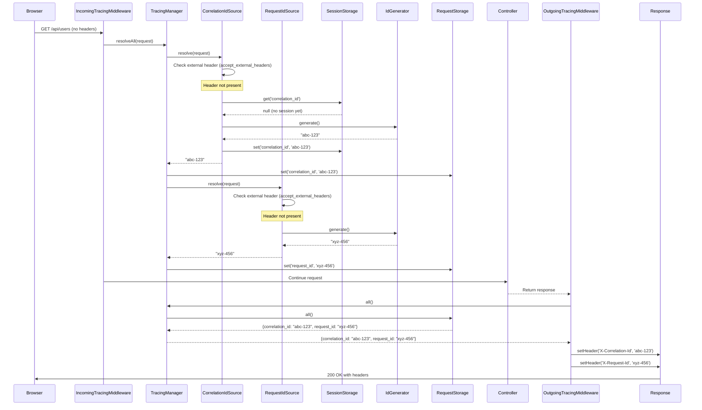

### Step-by-Step Flow

1. **Request Arrives**: Browser sends GET request with no tracing headers
2. **IncomingTracingMiddleware Executes**: Calls `TracingManager::resolveAll()`
3. **Resolve Correlation ID**:
   - Check if external header present → No
   - Check session storage → No (new session)
   - Generate new UUID → `abc-123`
   - Store in session → Persisted for future requests
   - Store in request storage → Available during this request
4. **Resolve Request ID**:
   - Check if external header present → No
   - Generate new UUID → `xyz-456`
   - Store in request storage → Available during this request
5. **Controller Executes**: Business logic runs (can access tracings via `LaravelTracing::all()`)
6. **OutgoingTracingMiddleware Executes**: Reads all tracings and attaches to response headers
7. **Response Sent**: Browser receives response with `X-Correlation-Id` and `X-Request-Id` headers

**Result**:
- ✅ Correlation ID `abc-123` stored in session (will be reused on next request)
- ✅ Request ID `xyz-456` generated for this request only
- ✅ Both headers attached to response

---

## Flow 2: Subsequent HTTP Request (Existing Session)

**Scenario**: Second request from the same user session.

### Sequence Diagram

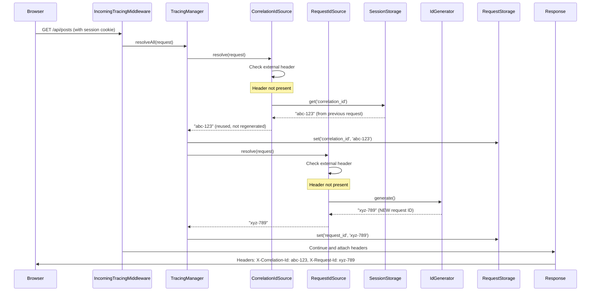

### Key Behavior

- **Correlation ID**: Reused from session (`abc-123`) → Same across all requests in session
- **Request ID**: Newly generated (`xyz-789`) → Different for each request
- **Session Persistence**: Session storage maintains correlation ID across requests

**Result**:
- ✅ Same correlation ID as first request (`abc-123`)
- ✅ New request ID for this request (`xyz-789`)
- ✅ Session continuity maintained

---

## Flow 3: Accepting External Tracing Headers

**Scenario**: External service forwards a request with existing tracing headers.

### Sequence Diagram

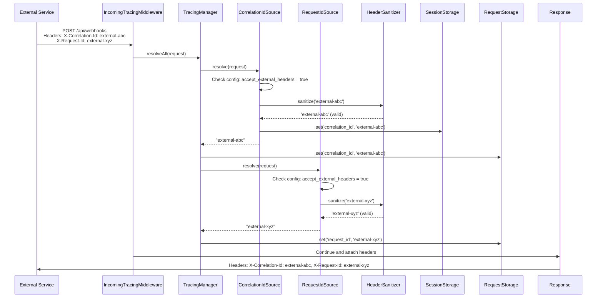

### Key Behavior

- **External Headers Accepted**: When `accept_external_headers = true`
- **Header Sanitization**: All incoming values are sanitized for security
- **Session Overwrite**: External correlation ID replaces any existing session value
- **Propagation**: External values are propagated back in response and to downstream services

**Security Note**: `HeaderSanitizer` validates all external values to prevent injection attacks.

**Result**:
- ✅ Uses external correlation ID (`external-abc`)
- ✅ Uses external request ID (`external-xyz`)
- ✅ Enables cross-service tracing

---

## Flow 4: Rejecting External Headers (Security Mode)

**Scenario**: External headers are disabled for security.

### Configuration

```php
// config/laravel-tracing.php
'accept_external_headers' => false,
```

### Sequence Diagram

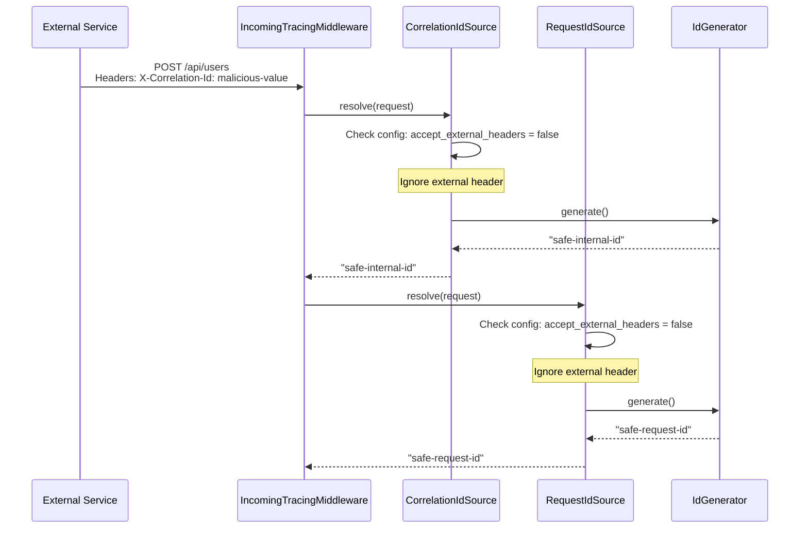

### Key Behavior

- **External Headers Ignored**: All incoming tracing headers are discarded
- **Internal Generation**: Package always generates its own IDs
- **Security Boundary**: Prevents external services from injecting tracing values

**Use Case**: Internal services that don't trust external tracing headers.

---

## Flow 5: Job Dispatch and Execution

**Scenario**: Queued job is dispatched during a traced request.

### Sequence Diagram

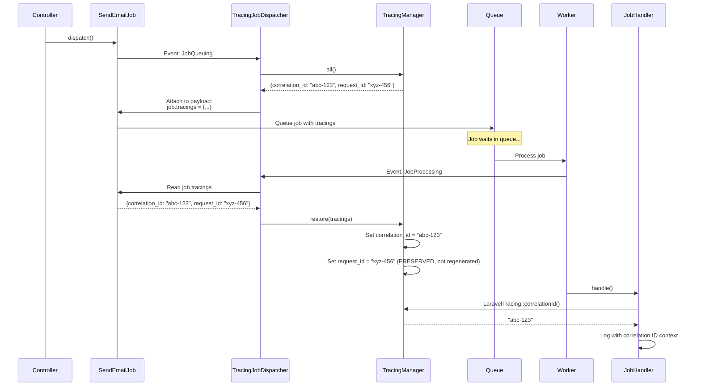

### Step-by-Step Flow

**1. Dispatching (in request context)**:
   - Controller dispatches job: `SendEmailJob::dispatch()`
   - Laravel fires `JobQueuing` event
   - `TracingJobDispatcher` listens to event
   - Dispatcher reads all current tracings from `TracingManager`
   - Dispatcher serializes tracings as key-value array
   - Dispatcher attaches tracings to job payload: `$job->tracings = [...]`
   - Job is queued with tracings embedded

**2. Execution (in worker context)**:
   - Queue worker picks up job
   - Laravel fires `JobProcessing` event (before `handle()`)
   - `TracingJobDispatcher` listens to event
   - Dispatcher reads `$job->tracings` from payload
   - Dispatcher calls `TracingManager::restore($tracings)`
   - Manager injects values into `RequestStorage`
   - Job's `handle()` method executes with tracings available
   - `LaravelTracing::correlationId()` returns original correlation ID

**Key Behavior**:
- **Original Request ID Preserved**: Job executes with the request ID from the dispatching request (not a new one)
- **Correlation ID Maintained**: Same correlation ID propagates through job execution
- **Global Accessor Works**: `LaravelTracing::all()` works inside job handlers

**Job Payload Example**:
```php
[
    'displayName' => 'App\\Jobs\\SendEmailJob',
    'job' => 'Illuminate\\Queue\\CallQueuedHandler@call',
    'data' => [
        'commandName' => 'App\\Jobs\\SendEmailJob',
        'command' => '...', // Serialized job
    ],
    'tracings' => [ // Attached by TracingJobDispatcher
        'correlation_id' => 'abc-123',
        'request_id' => 'xyz-456',
    ],
]
```

**Result**:
- ✅ Correlation ID propagated to job (`abc-123`)
- ✅ Original request ID preserved in job (`xyz-456`)
- ✅ Full tracing context available in job handler

---

## Flow 6: Outgoing HTTP Call with Tracing

**Scenario**: Application makes an external API call with tracing headers.

### Sequence Diagram

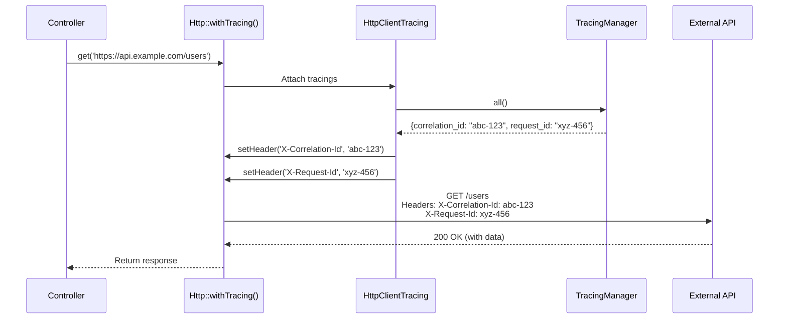

### Usage Examples

**Per-Request (Opt-in)**:
```php
use Illuminate\Support\Facades\Http;

$response = Http::withTracing()
    ->get('https://api.example.com/users');
```

**Global (via Config)**:
```php
// config/laravel-tracing.php
'http_client' => [
    'enabled' => true, // Attach tracings to ALL outgoing requests
],
```

### Key Behavior

- **Opt-In by Default**: Must explicitly call `withTracing()` or enable globally
- **All Tracings Forwarded**: All active tracings (correlation ID, request ID, custom tracings) are attached
- **External Service Receives**: Downstream service can read headers and continue the trace

**Result**:
- ✅ Tracings propagated to external API
- ✅ Enables distributed tracing across services
- ✅ External service can correlate requests

---

## Flow 7: Custom Tracing Source

**Scenario**: Developer adds custom `X-User-Id` tracing.

### Configuration

```php
// config/laravel-tracing.php
'tracings' => [
    'user_id' => [
        'enabled' => true,
        'header' => 'X-User-Id',
        'source' => \App\Tracings\UserIdSource::class,
    ],
],
```

### Custom Source Implementation

```php
namespace App\Tracings;

use JuniorFontenele\LaravelTracing\Tracings\Contracts\TracingSource;
use Illuminate\Http\Request;

class UserIdSource implements TracingSource
{
    public function resolve(Request $request): string
    {
        // Get authenticated user ID, or 'guest' if not authenticated
        return $request->user()?->id ?? 'guest';
    }

    public function headerName(): string
    {
        return 'X-User-Id';
    }

    public function restoreFromJob(string $value): string
    {
        return $value; // No transformation needed
    }
}
```

### Data Flow

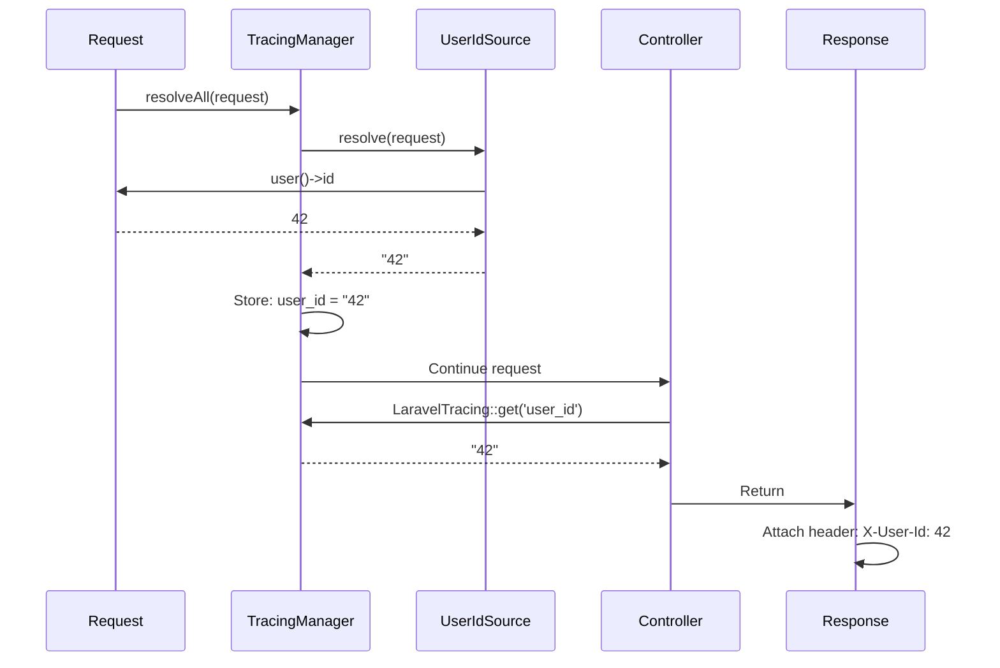

### Key Behavior

- **Custom Resolution Logic**: `UserIdSource` resolves user ID from authenticated user
- **Automatic Propagation**: User ID is automatically attached to responses, jobs, and HTTP calls
- **No Package Modification**: Registered via config, no changes to package code

**Result**:
- ✅ Custom tracing integrated seamlessly
- ✅ All standard tracing behaviors apply (response headers, job propagation, HTTP forwarding)

---

## Flow 8: Correlation ID Session Persistence

**Scenario**: Track correlation ID across multiple requests in the same user session.

### Multi-Request Flow

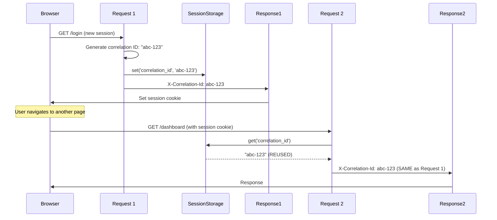

### Key Behavior

- **Session-Scoped Correlation ID**: Same correlation ID for all requests in the user session
- **Cross-Request Continuity**: Correlation ID survives across page navigation, form submissions, AJAX calls
- **Session Storage**: Laravel's session driver (file, database, redis) stores the value
- **Request ID Still Unique**: Each request gets a new request ID, but correlation ID remains constant

**Use Case**: Track all activity for a single user session across multiple requests.

**Example Log Output**:
```
[2026-02-10 10:00:00] correlation_id=abc-123 request_id=xyz-001 User logged in
[2026-02-10 10:00:05] correlation_id=abc-123 request_id=xyz-002 User viewed dashboard
[2026-02-10 10:00:10] correlation_id=abc-123 request_id=xyz-003 User updated profile
```

All three requests share the same `correlation_id` but have unique `request_id` values.

---

## Flow 9: Package Disabled

**Scenario**: Tracing is globally disabled via configuration.

### Configuration

```php
// config/laravel-tracing.php or .env
'enabled' => false,
// or
LARAVEL_TRACING_ENABLED=false
```

### Data Flow

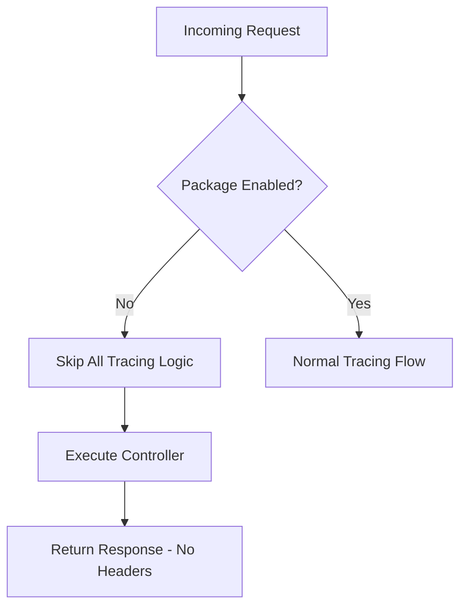

### Key Behavior

- **Middleware Skips Execution**: Middleware checks `config('laravel-tracing.enabled')` and exits early
- **No Headers Generated**: No tracing headers attached to responses
- **No Job Propagation**: Jobs are queued without tracing data
- **Global Accessor Returns Null**: `LaravelTracing::all()` returns empty array

**Use Case**: Disable tracing in local development or testing environments.

---

## Data Storage Summary

### Where Tracing Data Lives

| Storage Location | Scope | Data | Lifetime |
|------------------|-------|------|----------|
| **RequestStorage** | Current request | All resolved tracings | Request lifecycle |
| **SessionStorage** | User session | Correlation ID only | Session duration |
| **Job Payload** | Queued job | All tracings at dispatch time | Until job executes |
| **Response Headers** | HTTP response | All tracings | One-time (per response) |
| **HTTP Request Headers** | Outgoing API call | All tracings | One-time (per request) |

### Storage Flow Diagram

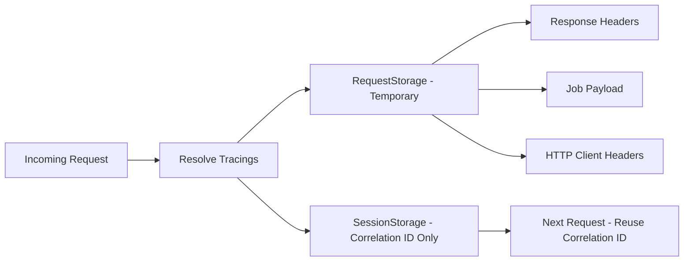

---

## Performance Considerations

### Lazy Resolution

- **When**: Tracings are resolved only once per request (in `IncomingTracingMiddleware`)
- **Caching**: Resolved values are cached in `RequestStorage` for the request lifecycle
- **No Re-Resolution**: Accessing `LaravelTracing::all()` multiple times doesn't trigger re-resolution

### Minimal Overhead

- **ID Generation**: UUID generation is fast (~0.1ms)
- **Session Read/Write**: Single session read/write per request for correlation ID
- **Header Attachment**: Simple string operations (negligible overhead)

**Expected Overhead**: <1ms per request for built-in tracings.

---

## Error Handling

### Invalid External Headers

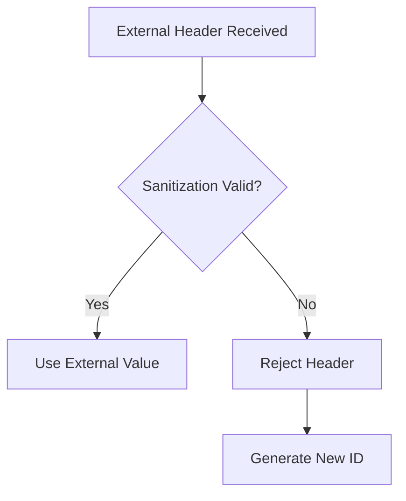

**Behavior**: Invalid external headers are rejected and a new ID is generated instead.

### Job Serialization Failure

**Behavior**: If job payload cannot be serialized with tracings, Laravel's queue system will fail the job (standard Laravel behavior).

**Mitigation**: Tracings are serialized as simple strings, which are always serializable.

---

## Related Documentation

- **[COMPONENTS.md](COMPONENTS.md)** → Component responsibilities and relationships
- **[STRUCTURE.md](STRUCTURE.md)** → Directory structure and file organization
- **[CONFIGURATION.md](CONFIGURATION.md)** → Configuration options and architecture
- **[EXTENSIONS.md](EXTENSIONS.md)** → How to extend and customize flows
- **[../PRD.md](../PRD.md)** → Functional requirements these flows implement

---

## Maintenance Notes

**When adding new flows**:

1. ✅ Document the scenario and sequence diagram
2. ✅ Explain key behavior and decision points
3. ✅ Update storage summary if new storage is introduced
4. ✅ Add to "Related Documentation" if relevant

**Keep this document synchronized with actual implementation.**
